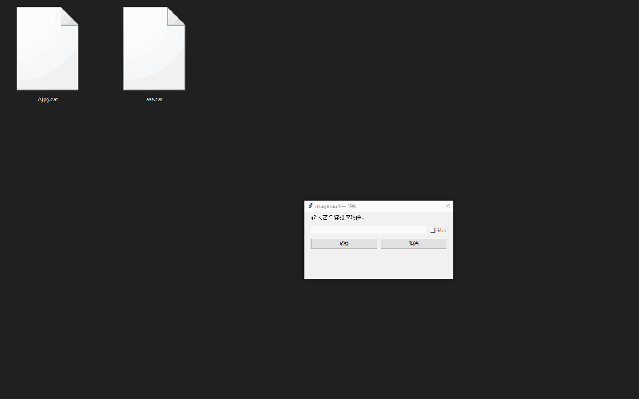
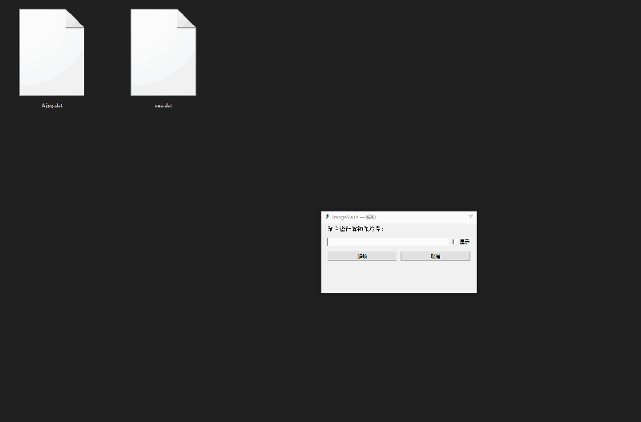
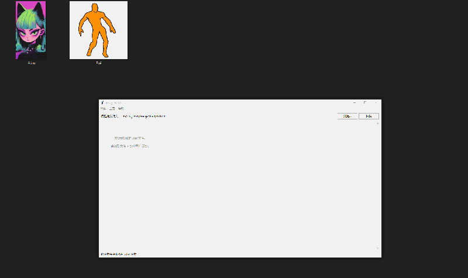
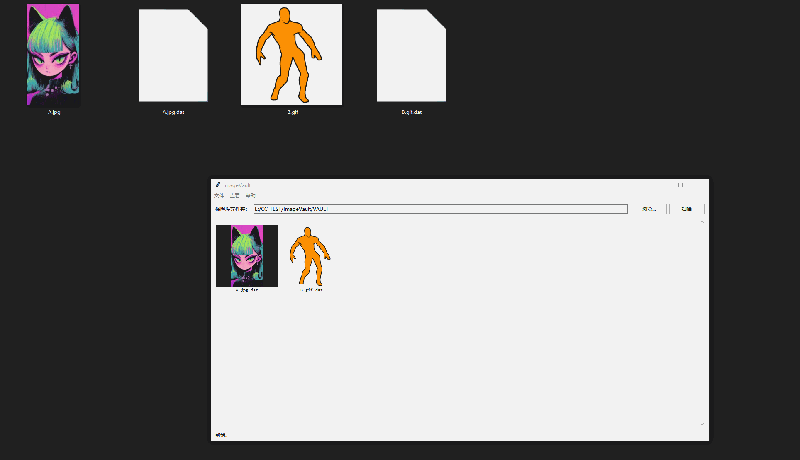
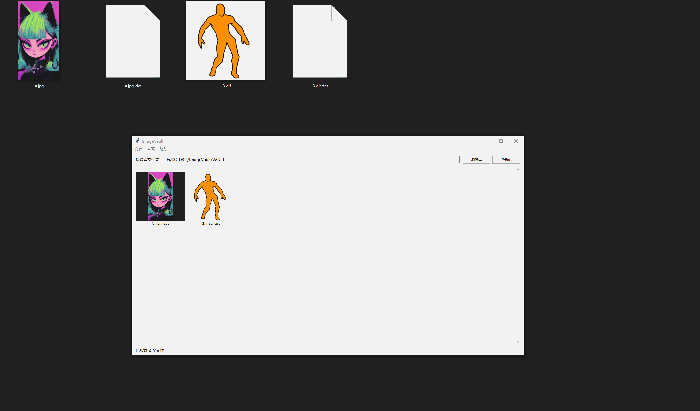
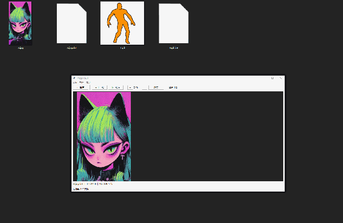
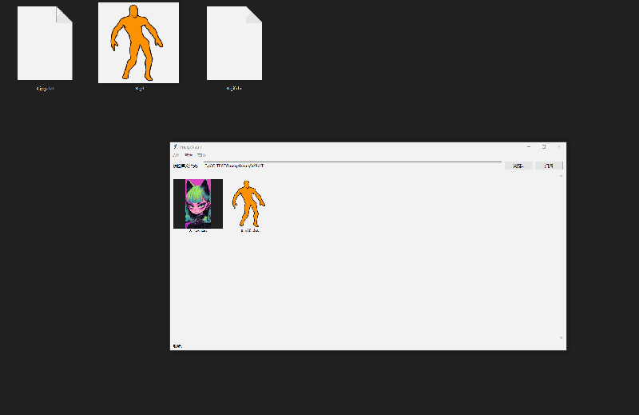
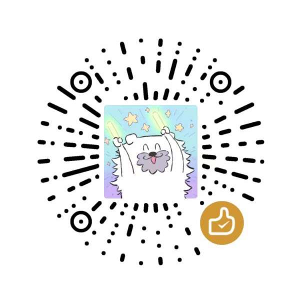

# ImageVault 🔒

> AES-256-GCM 加密图片保险库 | Encrypted Image Vault

一个安全、本地化的加密图片查看器。所有图片以 AES-256-GCM 加密存储，仅在内存中解密，**绝不写入磁盘**。

[](https://python.org)
[](LICENSE)

## 演示 Demo

<p align="center"><b>密码保护 — 正确密码 (123456) 正常显示</b></p>
<p align="center"></p>

<p align="center"><b>密码错误 (123) 无法看到加密图片</b></p>
<p align="center"></p>

<p align="center"><b>图片加密</b></p>
<p align="center"></p>

<p align="center"><b>解密浏览</b></p>
<p align="center"></p>

<p align="center"><b>图库浏览 + 无边框模式</b></p>
<p align="center"></p>

<p align="center"><b>GIF 动图支持</b></p>
<p align="center"></p>

<p align="center"><b>老板键一键隐藏</b></p>
<p align="center"></p>

---

## 功能 Features

| 功能 | 说明 |
|---|---|
| 🔐 **AES-256-GCM 加密** | 每张图片独立加密，PBKDF2 + HKDF 密钥派生 |
| 🖼️ **图库浏览** | 缩略图网格，快速预览 |
| 🔍 **无边框模式** | 右键进入，适合私密浏览 |
| 🖱️ **灵活操控** | Ctrl+滚轮缩放，Ctrl+拖拽平移，边缘拖拽调整窗口 |
| 🎞️ **GIF 动图支持** | 播放/暂停/逐帧查看，循环控制 |
| ⌨️ **老板键** | 全局快捷键一键隐藏/恢复，可自定义 |
| 🌐 **中/English 双语** | 设置中切换界面语言 |
| 📦 **单文件分发** | PyInstaller 打包，无需安装 Python |

## 安全 Security

- **加密算法**: AES-256-GCM（认证加密，防篡改）
- **密钥派生**: PBKDF2-HMAC-SHA256（100,000 次迭代）+ HKDF
- **密码不存储**: 每次启动输入密码，验证失败即报错
- **零明文写入**: 解密后的图片数据仅存在于内存中

## 快速开始 Quick Start

### 从源码运行

```bash
pip install -r requirements.txt
python main.py
```

### 打包为 .exe

```bash
pip install pyinstaller
build_exe.bat    # 或手动运行:
# pyinstaller --onefile --noconsole --name ImageVault --icon=icon.ico main.py
```

输出: `dist/ImageVault.exe` — 单文件，直接发给用户运行。

## 使用说明 Usage

1. 启动后输入密码解锁保险库
2. **文件 → 加密图片** 导入图片
3. 双击缩略图进入查看器
4. 右键 → **无边框查看** 进入沉浸模式
5. 帮助 → **设置** 自定义老板键和语言

---

## 打赏 Donate

<p align="center"><sub>如果觉得好用，请我喝杯咖啡 ☕</sub></p>
<p align="center"></p>

---

## 技术栈 Tech Stack

- **GUI**: Tkinter
- **图像**: Pillow + imageio
- **加密**: cryptography (PyCA)
- **打包**: PyInstaller

## Keywords

`image-viewer` `encryption` `privacy` `aes-256-gcm` `security` `python` `tkinter` `image-vault` `encrypted-gallery` `local-first`
